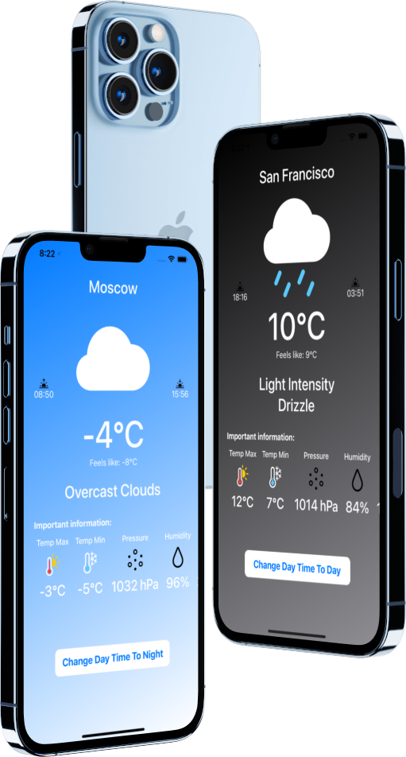
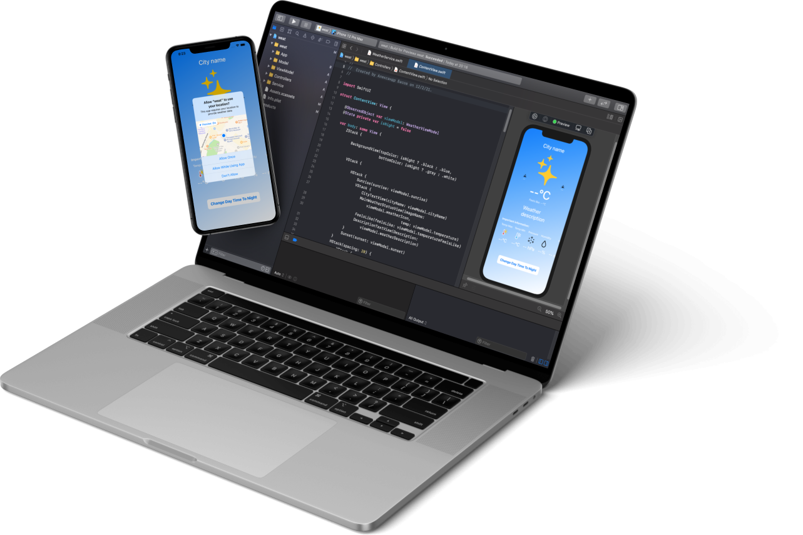

# WeatherSwiftUI

## Introduction

Hi, my name is Aleksandr. I'm glad to see you on my [GitHub](https://github.com/AleksandrBasov?tab=repositories).

## Features

The application is developed in Swift language. The app is entirely written in SwiftUi. I used MVVM architecture in my project.

<h1 align="center">

</h1>

The Weather application will display the weather forecast and the required weather data. The main picture will change depending on the weather. Displays a weather forecast based on your current location.

<h1 align="center">

</h1>
